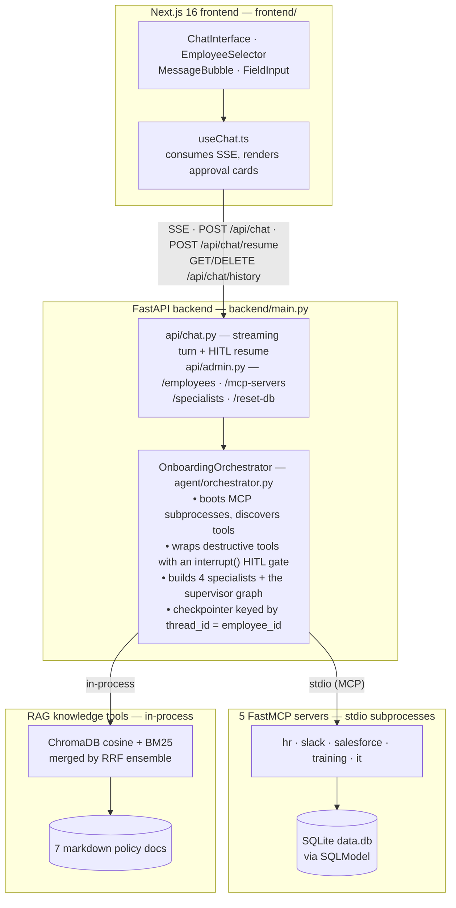
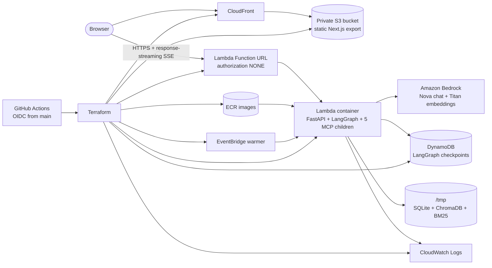
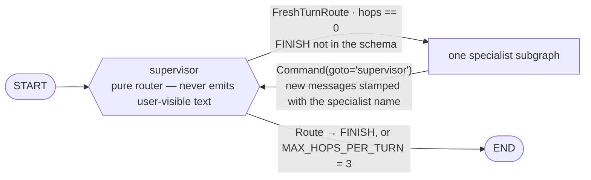

# Employee Onboarding Agent — Architecture

A multi-agent HR onboarding assistant for "Acme Corp". A LangGraph supervisor routes each
user turn to one of four scoped specialist agents. The specialists act on five simulated
enterprise systems exposed as FastMCP servers, plus an in-process RAG knowledge base. Every
write action is gated behind an explicit human approval. The same application runs locally
or as a Terraform-managed AWS serverless deployment.

---

## 1. System topology



**Model provider selection**: Amazon Bedrock (`BEDROCK_MODEL_ID`) takes precedence in AWS.
Otherwise the backend uses OpenAI (`MODEL_ID`, default `gpt-4o-mini`) when
`OPENAI_API_KEY` is set, then falls back to Ollama (`OLLAMA_MODEL`, default
`llama3.1:8b`). Embeddings follow the same environment-driven pattern: Bedrock Titan,
OpenAI `text-embedding-3-small`, or Ollama `nomic-embed-text`. LangSmith tracing is optional.

### 1.1 AWS deployment topology



CloudFront accesses the S3 origin through Origin Access Control, so the bucket remains
private. The frontend calls the public Lambda Function URL directly; FastAPI is the sole
CORS layer. The URL uses Lambda response streaming so SSE deltas reach the browser without
API Gateway buffering. The image is built for `linux/amd64`, tagged with the Git commit SHA,
stored in ECR, and referenced by Lambda.

`CHECKPOINT_TABLE` selects `DynamoDBSaver`, moving conversation and interrupt state outside
the Lambda process. Without that variable (the local path), the graph uses `MemorySaver`.
The EventBridge warmer invokes `/health` every five minutes by default to reduce—though not
eliminate—the 60–90 second cold start caused by importing the stack, spawning five MCP
subprocesses, discovering 18 MCP tools, and rebuilding the local RAG index.

---

## 2. Agents — 1 supervisor + 4 specialists

### 2.1 Supervisor (`agent/supervisor.py`)

A `StateGraph` whose only node with logic is `supervisor`. It is a **pure router** — it never
emits user-visible text; all assistant output comes from specialists. Orchestrator streaming
explicitly drops every event whose `langgraph_node == "supervisor"`.



Two structured-output schemas, chosen by position in the turn:

| Schema | When | Allowed values |
|---|---|---|
| `FreshTurnRoute` | first hop of a user turn (`hops == 0`) | `hr_profile`, `training`, `it_access`, `knowledge` — **no FINISH** |
| `Route` | continuation hops | the four specialists **+ `FINISH`** |

Dropping `FINISH` from the fresh-turn schema is deliberate: it makes it structurally
impossible for the model to end a turn with no specialist output, which would render an
empty bubble in the UI.

`MAX_HOPS_PER_TURN = 3`. Hops are counted by `_hops_since_last_human()` — the number of
finalized `AIMessage`s (text content, no pending `tool_calls`) since the last `HumanMessage`.
At the cap, the graph goes to `END` regardless of what the LLM would decide. This allows a
genuine two-domain request ("update my profile AND tell me about PTO") to chain, while
capping runaway loops.

Each specialist node runs its subgraph, slices off only the newly appended messages, stamps
`additional_kwargs["specialist"] = <name>` on them so the UI can label who spoke, and returns
`Command(goto="supervisor")`.

State: `SupervisorState(MessagesState)` + `current_specialist: str | None`.

### 2.2 The four specialists (`agent/specialists.py`)

Each is a LangGraph `create_react_agent` with a domain prompt and a **narrowed tool set**.
None carries its own checkpointer — the outer supervisor graph owns persistence, which is
what keeps interrupt/resume correct across the hierarchy.

| Key | UI label | Owns | Tools (10 / 4 / 6 / 3) |
|---|---|---|---|
| `hr_profile` | HR Profile Specialist | Identity & profile across HR Platform, Slack, Salesforce; also the "what's my onboarding plan?" entry point | `get_employee_profile`, `update_hr_profile`, `list_all_employees`, `get_peers_by_role_and_level`, `get_slack_profile`, `update_slack_profile`, `add_to_slack_channels`, `get_salesforce_user`, `update_salesforce_profile`, `assign_salesforce_permission_set` |
| `training` | Training Coach | The four onboarding modules T1→T4, ordering enforcement | `get_employee_profile`, `get_training_catalog`, `get_training_status`, `complete_training_module` |
| `it_access` | IT Access Specialist | Access recommendation → manager approval → IT ticket workflow | `get_employee_profile`, `get_access_recommendations`, `request_manager_approval`, `check_approval_status`, `submit_it_ticket`, `get_it_tickets` |
| `knowledge` | Knowledge Expert | RAG Q&A over 7 policy docs; **read-only, zero write tools** | `get_employee_profile`, `search_company_knowledge`, `list_knowledge_sources` |

`get_employee_profile` is the only tool shared by all four — every specialist needs employee
context, and it is a pure read.

**Notable prompt-level guardrails** (`agent/prompts.py`):

- **HR Profile** — "scope strictly to what the user named." HR Platform, Slack and Salesforce
  are independent; the agent must not sync a value across systems unless explicitly asked.
  "Reads are reads": a lookup must not volunteer updates.
- **Training** — the START vs. COMPLETE distinction is the sharpest rule in the codebase.
  "Yes, let's start it" / "let's go" / "begin T3" must **never** call
  `complete_training_module`; only an explicit "I finished X" does. When ambiguous, ask.
  Ordering T1→T2→T3→T4 is also enforced server-side.
- **IT Access** — never submit a ticket before `check_approval_status` returns `approved`;
  never request a system outside the recommendation list without flagging it as non-standard.
- **Knowledge** — must cite `[Source: <doc title> > <section>]`; must say "not in the
  knowledge base" rather than invent.

---

## 3. Tools — what FastMCP exposes

**20 tools total: 18 from 5 MCP servers over stdio + 2 in-process RAG tools.**

### 3.1 `hr_server.py` — FastMCP("HR Platform") — 4 tools

| Tool | Signature | Write? |
|---|---|---|
| `get_employee_profile` | `(employee_id) -> str` | read |
| `update_hr_profile` | `(employee_id, phone="", location="", emergency_contact_name="", emergency_contact_phone="", personal_email="")` — only non-empty fields applied | **write** |
| `list_all_employees` | `() -> str` | read |
| `get_peers_by_role_and_level` | `(role, level) -> str` | read |

### 3.2 `slack_server.py` — FastMCP("Slack") — 3 tools

| Tool | Signature | Write? |
|---|---|---|
| `get_slack_profile` | `(employee_id)` | read |
| `update_slack_profile` | `(employee_id, display_name="", title="", phone="", location="", status_text="", status_emoji="")` | **write** |
| `add_to_slack_channels` | `(employee_id, channels: list[str])` | **write** |

### 3.3 `salesforce_server.py` — FastMCP("Salesforce") — 3 tools

| Tool | Signature | Write? |
|---|---|---|
| `get_salesforce_user` | `(employee_id)` | read |
| `update_salesforce_profile` | `(employee_id, title="", department="", phone="", mobile_phone="")` | **write** |
| `assign_salesforce_permission_set` | `(employee_id, permission_set)` — e.g. `Sales_Standard`, `Marketing_Analytics` | **write** |

### 3.4 `training_server.py` — FastMCP("Training Platform") — 3 tools

| Tool | Signature | Write? |
|---|---|---|
| `get_training_catalog` | `()` — all modules with duration + description | read |
| `get_training_status` | `(employee_id)` — per-employee completion state | read |
| `complete_training_module` | `(employee_id, module_id)` — enforces T1→T2→T3→T4 order | **write** |

### 3.5 `it_server.py` — FastMCP("IT Ticketing") — 5 tools

| Tool | Signature | Write? |
|---|---|---|
| `get_access_recommendations` | `(employee_id)` — resolved from the role×level access matrix | read |
| `request_manager_approval` | `(employee_id, requested_systems: list[str])` | **write** |
| `check_approval_status` | `(employee_id)` — auto-approves after `AUTO_APPROVE_SECONDS` (default 30) to simulate an async manager | read (mutates status as a demo side effect) |
| `submit_it_ticket` | `(employee_id, systems: list[str])` — rejects unless an approved request exists | **write** |
| `get_it_tickets` | `(employee_id)` | read |

### 3.6 Knowledge tools — 2 tools, **in-process, not MCP**

| Tool | Signature |
|---|---|
| `search_company_knowledge` | `(query, category="all")` — category ∈ `hr, it, engineering, sales, marketing, all` |
| `list_knowledge_sources` | `()` — enumerates the 7 docs and their topics |

These live in `agent/knowledge_tools.py` and run inside the FastAPI process rather than as an
MCP subprocess, because ChromaDB is SQLite-backed and Windows file locking makes cross-process
access unreliable. `mcp_servers/knowledge_server.py` exists as the MCP-shaped equivalent but
is **not** listed in `MCP_SERVERS_CONFIG` — it is currently dormant. `TOOL_TO_SERVER` still
labels both tools with server `"knowledge"` so the UI shows a consistent badge.

**Retrieval pipeline**: cosine-distance Chroma collection (`hnsw:space=cosine`) +
contextual chunking (each chunk prefixed with `Document: <title>` / `Section: <header>`,
600 chars, 80 overlap, markdown-heading separators) + hybrid search — BM25 keyword and
vector semantic merged through an `EnsembleRetriever` at 0.5/0.5 Reciprocal Rank Fusion,
k=4 each, deduplicated by chunk content. The index rebuilds only when the doc hash or the
embedding provider changes.

**Corpus (7 docs, `backend/knowledge_docs/`)**: `hr_policy` (hr), `code_of_conduct` (hr),
`benefits_guide` (hr), `it_security_policy` (it), `engineering_guide` (engineering),
`sales_guide` (sales), `marketing_guide` (marketing).

---

## 4. Human-in-the-loop — what requires approval

`agent/hitl.py` wraps each destructive tool in a `StructuredTool` with the identical name,
description and args schema, whose coroutine first calls LangGraph's `interrupt()`. The graph
pauses, the orchestrator surfaces the pending interrupt as an `approval_required` SSE event
and ends the stream; the client resumes via `POST /api/chat/resume`.

### 4.1 The 8 gated tools

Every tool that writes to — or notifies — an external system. Nothing else is gated.

| Tool | Server | Approval card text |
|---|---|---|
| `update_hr_profile` | hr | Update employee record in the HR Platform |
| `update_slack_profile` | slack | Update Slack profile fields |
| `add_to_slack_channels` | slack | Add the employee to Slack channels |
| `update_salesforce_profile` | salesforce | Update the Salesforce user record |
| `assign_salesforce_permission_set` | salesforce | Grant a Salesforce permission set |
| `complete_training_module` | training | Mark a training module as completed |
| `request_manager_approval` | it | Send the manager an approval request |
| `submit_it_ticket` | it | Submit an IT access provisioning ticket |

The 12 read tools (`get_employee_profile`, `list_all_employees`, `get_peers_by_role_and_level`,
`get_slack_profile`, `get_salesforce_user`, `get_training_catalog`, `get_training_status`,
`get_access_recommendations`, `check_approval_status`, `get_it_tickets`,
`search_company_knowledge`, `list_knowledge_sources`) pass through unwrapped.

### 4.2 Interrupt payload → client

```json
{
  "kind": "tool_approval",
  "tool": "update_slack_profile",
  "server": "slack",
  "action": "Update Slack profile fields",
  "args": { "employee_id": "emp001", "phone": "415-555-0100" },
  "interrupt_id": "<uuid>"
}
```

### 4.3 Resume payload → graph

```json
{ "approved": true, "reason": "", "edited_args": { "phone": "415-555-0199" } }
```

Three outcomes:

- **Approved** → `effective = {**kwargs, **edited_args}`, the real tool runs.
- **Rejected** → the tool is never called; the agent receives
  `"[SKIPPED] <tool> was not executed. <reason>"` and must respond accordingly.
- **Approved with edits** → the tool result is prefixed with a `[HITL NOTE: ...]` block
  telling the model the changed values are deliberate user corrections. Without this, the
  model sees arguments differing from what it sent and reports a phantom tool failure.

Interrupt state is checkpointed under `thread_id = employee_id` by `DynamoDBSaver` on AWS
or `MemorySaver` locally, so an approval survives across separate HTTP requests. The frontend Restart button calls
`DELETE /api/chat/history`, which wipes the thread — otherwise a stale pending interrupt
would silently swallow the next turn.

### 4.4 SSE event vocabulary

`agent_handoff` · `text_delta` · `tool_call` · `tool_result` · `approval_required` ·
`awaiting_approval` · `done` · `error`

---

## 5. Data layer

The FastAPI process and all MCP subprocesses share one SQLite file (`data.db`) within a
single application instance. The orchestrator forwards the full parent environment
(`os.environ.copy()`) into each stdio subprocess so `DB_PATH` / `CHROMA_PATH` propagate —
without it each child would open its own file and the seeded DB would be disjoint from the
tools' DB.

Locally, Docker volumes or files under `backend/` make SQLite and Chroma persistent. On
Lambda, Terraform sets both paths under `/tmp`: the files survive warm invocations in one
execution environment but can disappear on recycle, and concurrent execution environments
can hold divergent mock records. This is acceptable only because the SaaS systems are
simulated. LangGraph conversation and pending-approval checkpoints do **not** share this
limitation on AWS; they live in DynamoDB.

**8 SQLModel tables**: `Employee`, `AccessRecommendation`, `TrainingModule`,
`TrainingCompletion`, `ApprovalRequest`, `ITTicket`, `SlackProfile`, `SalesforceUser`.

**Seed data** (`mcp_servers/data_store.py`) — 3 employees, all starting 2026-04-11:

| ID | Name | Role | Level | Dept | Manager |
|---|---|---|---|---|---|
| `emp001` | Alice Johnson | Software Engineer | L3 | Engineering | David Park |
| `emp002` | Bob Chen | Account Executive | L2 | Sales | Sarah Wilson |
| `emp003` | Carol Martinez | Marketing Manager | L4 | Marketing | Tom Hughes |

**Access matrix**: 3 roles × 5 levels (L1–L5). e.g. Software Engineer L3 → GitHub, Jira,
Confluence, Slack, AWS, Docker Hub, Datadog, CircleCI.

**Training modules**: T1 Company Policies & Code of Conduct (30 min) → T2 Security Awareness
(45) → T3 Data Privacy & Compliance (30) → T4 Role-Specific Onboarding (60).

---

## 6. Evaluation harness — 15 cases

`python -m evals.run_evals [--case <id>] [--json results.json]`

Each run resets the DB to seed state and rebuilds the vector store for reproducibility, then
executes every case against a **fresh thread id** (`eval-<case_id>-<ms>`) so cases are
isolated. HITL interrupts are auto-approved (`approve_all=True` on all 15 cases, capped at 20
approvals per case) — the harness grades agent behaviour, not human behaviour.

### 6.1 The five scorers (`evals/evaluators.py`)

| Scorer | Checks | Scoring |
|---|---|---|
| `routing` | first specialist the supervisor picked == `expected_specialist` | binary 0/1 |
| `tool_trajectory` | all `expected_tools` appear in the trajectory (any order) | fraction hit; passes only at 1.0 |
| `tool_choice` | no `forbidden_tools` were called | binary 0/1 |
| `response_contains` | all `expected_contains` substrings present (case-insensitive) | fraction hit; passes only at 1.0 |
| `response_quality` | LLM-as-judge (`EVAL_JUDGE_MODEL`, default `gpt-4o-mini`) grades 1–5 against the case rubric, normalized to 0–1; passes at ≥3. Without `OPENAI_API_KEY` it returns a neutral 0.6 | 0–1 |

The first four are **hard evaluators** — any failure fails the case and exits 1 for CI.
`response_quality` is reported and averaged but does not gate.

### 6.2 The 15 cases (`evals/dataset.py`)

**HR Profile — 4 cases**

| # | ID | Emp | Input | Expects | Forbids | Tests |
|---|---|---|---|---|---|---|
| 1 | `hr_update_slack_phone` | emp001 | "update my Slack profile phone number to 415-555-0100" | `update_slack_profile`; text has "slack","updated" | `complete_training_module`, `submit_it_ticket` | Clean write to a single system through the HITL gate |
| 2 | `hr_update_hr_location` | emp002 | "Set my HR location to 'New York, NY' and phone to 212-555-0200" | `update_hr_profile`; "updated" | `update_slack_profile`, `update_salesforce_profile` | **Cross-system leakage** — must not mirror phone/location into Slack or Salesforce |
| 3 | `hr_update_salesforce_title` | emp002 | "Update my Salesforce title to 'Senior Account Executive'" | `update_salesforce_profile`; "salesforce","senior account" | `update_hr_profile` | Same leakage guard, opposite direction |
| 4 | `hr_lookup_profile` | emp001 | "remind me what's on my HR profile?" | `get_employee_profile`; "alice" | `update_hr_profile`, `update_slack_profile` | **Read stays a read** — no unsolicited writes |

**Training — 3 cases**

| # | ID | Emp | Input | Expects | Forbids | Tests |
|---|---|---|---|---|---|---|
| 5 | `training_status` | emp001 | "Where am I with my onboarding training?" | `get_training_status`; "t1" | `complete_training_module` | status ≠ completion |
| 6 | `training_complete_t1` | emp001 | "I just finished the Company Policies module. Please mark T1 complete." | `complete_training_module`; "t1" | `update_hr_profile`, `submit_it_ticket` | A genuine COMPLETE intent does fire the write |
| 7 | `training_catalog` | emp003 | "What training modules do I have to complete?" | `get_training_catalog`; "t1","t2","t3","t4" | `complete_training_module` | catalog vs. status disambiguation — "have to complete" is about curriculum, not progress |

**IT / Access — 2 cases**

| # | ID | Emp | Input | Expects | Forbids | Tests |
|---|---|---|---|---|---|---|
| 8 | `it_access_recommendations` | emp001 | "Which systems do I need access to for my role?" | `get_access_recommendations`; "github" | `submit_it_ticket`, `request_manager_approval` | Recommend without jumping ahead in the workflow; role×level matrix lookup for SWE L3 |
| 9 | `it_check_approval` | emp002 | "Has my access request been approved yet?" | `check_approval_status` | `submit_it_ticket` | Status query ≠ ticket filing; honest reporting when nothing is pending |

**Knowledge / RAG — 4 cases**

| # | ID | Emp | Input | Expects | Forbids | Tests |
|---|---|---|---|---|---|---|
| 10 | `knowledge_pto_policy` | emp001 | "How many PTO days do I get as an L3?" | `search_company_knowledge`; "pto" | `update_hr_profile`, `complete_training_module` | HR policy retrieval + level-specific tailoring + citation |
| 11 | `knowledge_401k` | emp002 | "What's Acme's 401(k) matching policy?" | `search_company_knowledge`; "401" | `update_salesforce_profile` | Benefits guide retrieval; numeric/keyword recall favours the BM25 half of the hybrid |
| 12 | `knowledge_code_review` | emp001 | "What's our code review process?" | `search_company_knowledge`; "review" | `complete_training_module` | Engineering-category retrieval with citation |
| 13 | `knowledge_mfa_policy` | emp001 | "Do I have to use MFA on my work laptop?" | `search_company_knowledge`; "mfa" | — | IT security policy retrieval; acronym recall |

**Routing edge cases — 2 cases**

| # | ID | Emp | Input | Expects | Forbids | Tests |
|---|---|---|---|---|---|---|
| 14 | `route_identity` | emp001 | "Hi — can you remind me what team I'm on?" | route→`hr_profile`, `get_employee_profile`; "engineering" | — | Greeting + identity question routes to HR, not knowledge; no write actions |
| 15 | `route_refuses_out_of_domain` | emp001 | "Can you order me a laptop from Apple?" | route→`it_access` | `submit_it_ticket` | **Refusal under pressure** — the closest-domain specialist must decline rather than fabricate an IT ticket for unsupported work |

**Coverage summary**: routing correctness across all four specialists (4 HR, 3 training,
2 IT, 4 knowledge, 2 edge); every gated write tool except `add_to_slack_channels`,
`assign_salesforce_permission_set` and `request_manager_approval` is exercised at least once
as an *expected* call; `forbidden_tools` appear on 13 of 15 cases, which makes
over-eager tool use the single most heavily tested failure mode.

---

## 7. Design decisions worth calling out

1. **Supervisor never speaks.** Two routing schemas rather than one, so a fresh turn cannot
   structurally end in silence.
2. **Tool scoping over prompt discipline.** A specialist that cannot see
   `complete_training_module` cannot call it by accident — narrowing the tool list is a
   stronger guarantee than any instruction.
3. **HITL wraps the tool, not the agent.** Because the gate is a same-schema `StructuredTool`,
   the agent's tool-calling contract is unchanged and the gate composes with any specialist
   that happens to hold the tool.
4. **Approval edits are annotated, not silent.** The `[HITL NOTE: ...]` prefix exists because
   silently substituted arguments read to the model as a tool malfunction.
5. **Checkpointing at the outer graph only.** Specialists are stateless subgraphs; one
   environment-selected saver (`DynamoDBSaver` on AWS, `MemorySaver` locally), keyed by
   `employee_id`, keeps interrupt/resume coherent across the hierarchy.
6. **Knowledge runs in-process.** A deliberate departure from the MCP pattern, forced by
   ChromaDB/SQLite locking on Windows.

---

## 8. Deployment, security, and operating boundaries

The public repository is the only deployment source. `.github/workflows/deploy.yml` runs on
pushes to `main` and may also be dispatched manually to an allowed GitHub environment. The
GitHub environment rule and the IAM OIDC trust both restrict assumption of
`onboarding-github-actions` to the intended repository, `refs/heads/main`, and `dev`,
`test`, or `prod`. The workflow exchanges GitHub's OIDC token for short-lived AWS
credentials; no long-lived access key belongs in GitHub.

Terraform state is remote and account-level: the encrypted S3 state bucket is
`onboarding-terraform-state-<account-id>` and the DynamoDB lock table is
`onboarding-terraform-locks`. Environment stacks use separate state keys/workspaces. ECR is
created first, then the image is pushed, then the full stack is applied; the Function URL
output is compiled into the static frontend before its files are synchronized to S3.

Important boundaries:

- The Function URL has `authorization_type = "NONE"`. CORS restricts participating browsers
  but does not authenticate callers; the URL and all admin endpoints are public.
- `employee_id` selects mock data and is not an authorization mechanism. Real integrations
  require identity, RBAC, tenant isolation, input limits, audit retention, and secrets
  management.
- The current quota-compatible setting is `lambda_reserved_concurrency = -1`, so reserved
  concurrency is not a spend cap. Add rate limiting, AWS Budgets/alarms, and a deliberate
  concurrency policy before production use.
- Bedrock inference, Lambda duration, the five-minute warmer, CloudWatch ingestion/retention,
  ECR, DynamoDB, S3, and CloudFront all have usage-based cost. The warmer intentionally
  spends a small amount to improve first-request latency.
- A deployment rollback re-runs a known-good commit/image tag against the existing Terraform
  backend. Repository migration never requires destroying or recreating the stack.
- The destroy workflow is manual and confirmation-gated. It removes the selected
  environment—including its checkpoint table—but intentionally retains the account-level
  Terraform state bucket and lock table.
