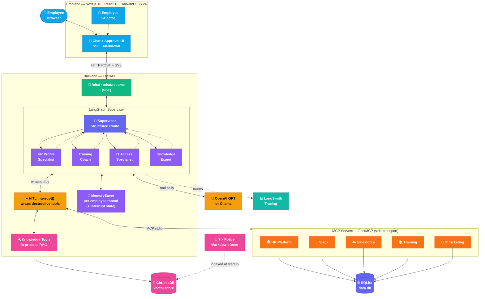
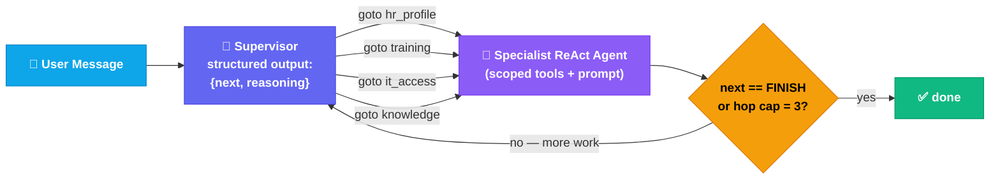
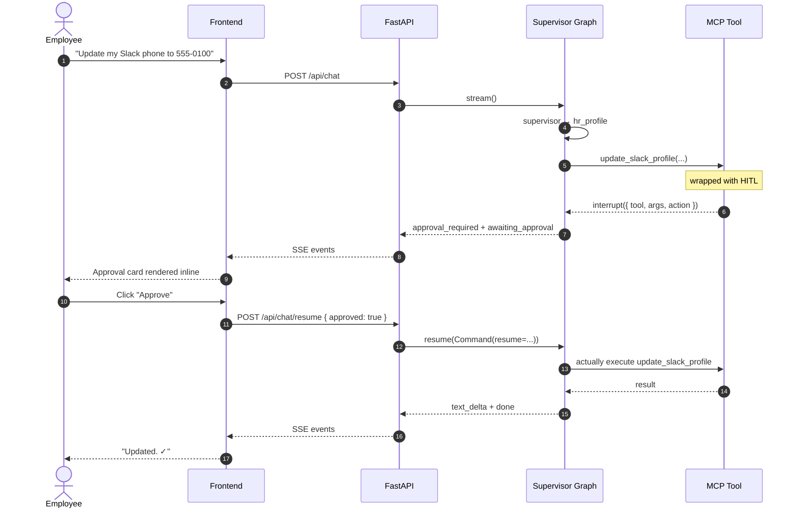
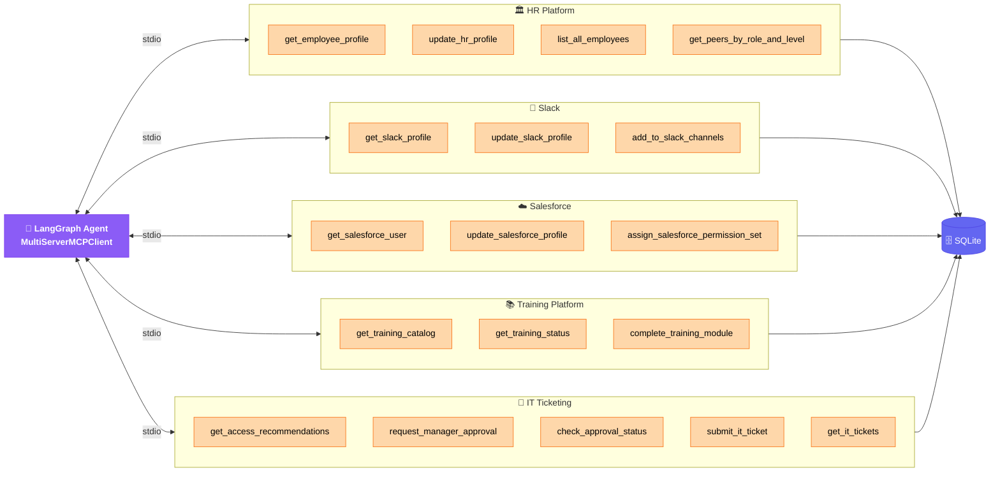
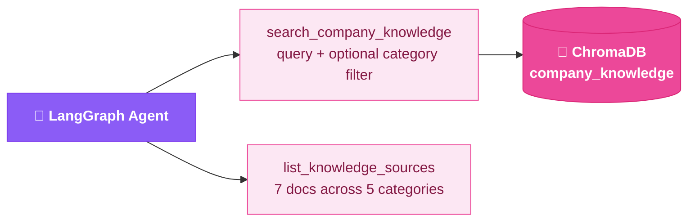
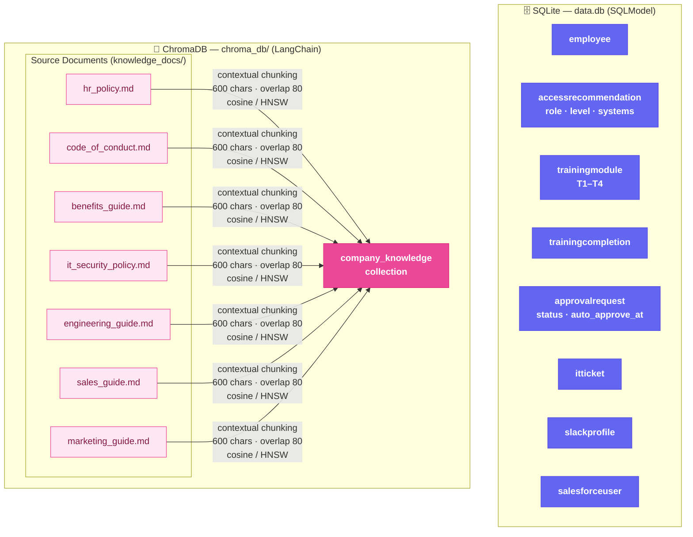

# Acme Corp — Employee Onboarding Agent

> An autonomous AI agent that guides new employees through their entire onboarding journey — updating profiles across SaaS platforms, completing training, requesting system access, and answering role-specific questions from a RAG-powered company knowledge base.


---

## Overview

The **Employee Onboarding Agent** is a full-stack agentic application built as a production-minded prototype. It demonstrates:

- **Multi-agent supervisor architecture** — a LangGraph supervisor routes each user turn to one of four scoped specialist ReAct agents (HR Profile, Training Coach, IT Access, Knowledge Expert). Multi-domain requests can chain specialists in a single turn.
- **Ask-first specialists** — specialists propose a plan and ask for missing information (timezone, preferred display name, which systems to request) before firing writes. Clear imperatives with full values still execute immediately; the HITL gate is the final review.
- **Human-in-the-loop for every write** — destructive tools (profile updates, training completions, approval requests, IT tickets) pause the graph via LangGraph `interrupt()`. An inline approval card lets the user review, **edit the tool's arguments**, then approve or reject — the run resumes only after the decision.
- **MCP-style extensibility** — each SaaS integration is a standalone FastMCP server; adding a new one requires zero changes to the orchestration logic
- **Production RAG** over 7 internal policy documents — hybrid BM25 keyword + vector semantic search merged via Reciprocal Rank Fusion, contextual chunking (each chunk prefixed with document title and section header), and cosine similarity (HNSW). Automatic rebuild when documents or the embedding provider changes
- **Evaluation harness** — a 15-case golden dataset graded by four deterministic evaluators plus an LLM-as-judge; exits non-zero on any hard-gate regression so it can plug straight into CI
- **Persistent state** — all structured data backed by SQLite via SQLModel; interrupt/resume state checkpointed per-employee so approvals survive across separate HTTP turns
- **Real-time streaming** — SSE delivers specialist handoffs, tool calls, approval requests, and response tokens to the frontend as they happen
- **Rich markdown rendering** — agent responses rendered with full formatting (headings, lists, code blocks, tables)
- **LangSmith tracing** — full visibility into every supervisor decision, specialist hop, tool call, and token

---

## System Architecture



---

## Supervisor Loop — Multi-Agent Routing



The supervisor never speaks to the user — it's a pure router that uses structured
output (`Route{next, reasoning}`) to pick one of four specialists per hop. Each
specialist is a `create_react_agent` subgraph with a **scoped toolbox**, so tool
choice stays tight: the Training Coach literally can't accidentally submit an IT
ticket. Multi-domain requests (*"update my profile AND tell me about PTO"*) are
handled by chaining specialists — the supervisor re-runs after each one and can
route again or FINISH. A hop cap of 3 prevents routing loops.

---

## Human-in-the-Loop — Approval Before Every Write



Eight tools are gated — every `update_*`, `add_to_slack_channels`,
`assign_salesforce_permission_set`, `complete_training_module`,
`request_manager_approval`, and `submit_it_ticket`. The wrapper calls
`interrupt()` before invoking the underlying MCP tool; state is checkpointed
by the same `MemorySaver` that stores conversation history, so an approval
request survives across two separate HTTP turns without any server-side
session state. Rejections are delivered back to the agent as a
`[SKIPPED] <tool> was not executed. <reason>` tool message, which the
specialist handles gracefully ("Understood — I'll leave your profile as-is").

**Editable arguments.** The approval card surfaces every field the tool would
be called with. String-valued args are editable inline; when the user clicks
*"Approve with edits"*, only the changed keys are sent in `edited_args`, and
the HITL wrapper merges them with the agent's original kwargs
(`{**kwargs, **edited_args}`) before invoking the tool. This turns
rubber-stamping into a genuine review step.

---

## Onboarding Workflow


---

## Tool Architecture

The four specialists share a pool of **20 tools** from two sources. Each specialist only sees the subset relevant to its domain; **8 destructive tools are wrapped with an HITL interrupt**.

### MCP Servers (5 × FastMCP subprocess, stdio transport)

Each simulates an external SaaS platform. Adding a new server requires **zero changes** to the agent or orchestration logic. Destructive tools (marked 🔒 below) are wrapped at load time with a LangGraph `interrupt()` gate.



### In-Process Tools (2 × LangChain @tool, ChromaDB RAG)

Knowledge search runs in the main FastAPI process to avoid cross-process ChromaDB file-locking issues on Windows.



---

## Data Architecture



---

## Tech Stack

| Layer | Technology | Purpose |
|---|---|---|
| **Frontend** | Next.js 16, React 19, Tailwind CSS v4, react-markdown | Chat UI, SSE streaming, markdown rendering |
| **Backend** | FastAPI, Python 3.13, Uvicorn | REST API, SSE endpoint, app lifecycle |
| **Agent Orchestration** | LangGraph `StateGraph` + `create_react_agent` subgraphs | Supervisor routing + four scoped specialists + per-employee MemorySaver |
| **Human-in-the-Loop** | LangGraph `interrupt()` + `Command(resume=...)` | Approval gate before every destructive tool; state checkpointed across HTTP turns |
| **Evaluation** | Custom harness + LangSmith tracing | 15-case golden dataset · 4 deterministic scorers + LLM-as-judge |
| **LLM** | OpenAI GPT-4o-mini / Ollama | Reasoning, tool selection, response generation |
| **MCP Servers** | FastMCP 2.3 | 5 independent mock SaaS integrations (stdio) |
| **MCP Client** | langchain-mcp-adapters | Bridges LangGraph ↔ MCP stdio protocol |
| **Knowledge Tools** | LangChain `@tool` + ChromaDB + rank-bm25 | In-process hybrid RAG: BM25 keyword + vector semantic search via Reciprocal Rank Fusion, contextual chunking, cosine similarity |
| **Structured Data** | SQLModel + SQLite | Employees, training, approvals, tickets |
| **Vector Store** | ChromaDB + langchain-chroma | Semantic search with auto-rebuild on provider change |
| **Embeddings** | OpenAI `text-embedding-3-small` / Ollama `nomic-embed-text` | Document indexing and query embedding |
| **Logging** | structlog | Structured JSON file logs + pretty console |
| **Tracing** | LangSmith | Full agent run visibility |

---

## Project Structure

```
EmployeeOnboardingAgent/
├── frontend/                          # Next.js 16 application
│   └── app/
│       ├── components/
│       │   ├── ChatInterface.tsx      # Main chat UI with SSE streaming
│       │   ├── MessageBubble.tsx      # Markdown rendering + tool activity cards
│       │   └── EmployeeSelector.tsx   # Login / employee picker
│       ├── hooks/
│       │   └── useChat.ts             # SSE streaming state management
│       ├── types/index.ts             # Shared TypeScript types + server colour map
│       ├── page.tsx                   # Root: selector → chat
│       └── layout.tsx
│
└── backend/                           # FastAPI + LangGraph application
    ├── main.py                        # App entry point, startup sequence
    │
    ├── agent/
    │   ├── orchestrator.py            # Orchestrator: graph lifecycle + streaming + resume
    │   ├── supervisor.py              # StateGraph supervisor (structured-output router)
    │   ├── specialists.py             # Four scoped ReAct sub-agents + tool scoping
    │   ├── hitl.py                    # interrupt() wrapper for destructive tools
    │   ├── knowledge_tools.py         # In-process RAG tools (ChromaDB search)
    │   └── prompts.py                 # Supervisor + specialist system prompts
    │
    ├── evals/                         # Agent evaluation harness
    │   ├── dataset.py                 # 15 golden cases across all specialists
    │   ├── evaluators.py              # Routing, trajectory, tool-choice, LLM-judge
    │   ├── run_evals.py               # python -m evals.run_evals
    │   └── README.md
    │
    ├── mcp_servers/                   # One FastMCP server per SaaS
    │   ├── data_store.py              # Seed data (canonical source of truth)
    │   ├── hr_server.py               # HR Platform tools
    │   ├── slack_server.py            # Slack tools
    │   ├── salesforce_server.py       # Salesforce tools
    │   ├── training_server.py         # Training Platform tools
    │   └── it_server.py               # IT Ticketing + manager approval
    │
    ├── database/
    │   ├── engine.py                  # SQLModel engine (shared SQLite file)
    │   ├── models.py                  # All table definitions
    │   └── seed.py                    # One-time data seeding + reset
    │
    ├── knowledge/
    │   └── vector_store.py            # ChromaDB build + provider-aware rebuild
    │
    ├── knowledge_docs/                # Source documents for RAG
    │   ├── hr_policy.md
    │   ├── code_of_conduct.md
    │   ├── benefits_guide.md
    │   ├── it_security_policy.md
    │   ├── engineering_guide.md
    │   ├── sales_guide.md
    │   └── marketing_guide.md
    │
    ├── api/
    │   ├── chat.py                    # /chat (SSE) · /chat/resume (HITL) · /chat/history
    │   └── admin.py                   # Employees · MCP servers · specialists · DB reset
    │
    ├── utils/
    │   └── logger.py                  # structlog — console + rotating file handler
    │
    ├── logs/                          # Auto-created; app.log rotates at 10 MB
    ├── data.db                        # SQLite database (auto-created)
    ├── chroma_db/                     # ChromaDB persistence (auto-created)
    ├── requirements.txt
    └── .env
```

---

## Getting Started

Two supported paths: **Docker** (fastest, one command) or **local development** (hot reload, direct access to `uv` / `npm`). Pick whichever suits your workflow.

### Option A — Docker (recommended)

Spin up the full stack (backend, frontend, and persistent volumes) with one command.

**Prerequisites:** Docker Desktop 4.x or Docker Engine 24+ with the compose plugin.

```bash
# 1. Configure the backend environment
cp backend/.env.example backend/.env
# Edit backend/.env — add OPENAI_API_KEY, or configure Ollama settings

# 2. Build and start both services
docker compose up --build
```

Open [http://localhost:3000](http://localhost:3000).

On first boot the backend seeds the SQLite database, indexes the 7 knowledge docs into ChromaDB, and spawns the 5 FastMCP subprocesses. Subsequent starts reuse the seeded state.

**Services and ports**

| Service    | Port | Image                        |
|------------|------|------------------------------|
| `backend`  | 8000 | `onboarding-backend:latest`  |
| `frontend` | 3000 | `onboarding-frontend:latest` |

**Persistent volumes** — survive `docker compose down`, wiped by `docker compose down -v`.

| Volume           | Mounted at        | Contents                                    |
|------------------|-------------------|---------------------------------------------|
| `backend-data`   | `/app/data`       | SQLite DB — employees, approvals, tickets   |
| `backend-chroma` | `/app/chroma_db`  | ChromaDB index over `knowledge_docs/`       |
| `backend-logs`   | `/app/logs`       | Structured JSON application logs            |

**Talking to a host-side Ollama**

The backend container reaches the host via `host.docker.internal` (already mapped in `docker-compose.yml`). In `backend/.env`:

```env
OLLAMA_BASE_URL=http://host.docker.internal:11434
```

**Pointing the browser at a non-default backend**

`NEXT_PUBLIC_API_URL` is baked into the frontend bundle at build time. Override it when the browser needs to reach the backend at a URL other than `http://localhost:8000`:

```bash
NEXT_PUBLIC_API_URL=http://192.168.1.20:8000 docker compose up --build
```

**Common commands**

```bash
docker compose logs -f backend          # tail backend logs
docker compose logs -f frontend         # tail frontend logs
docker compose restart backend          # restart the backend only
docker compose down                     # stop both services (keep volumes)
docker compose down -v                  # stop and wipe all volumes (full reset)
docker compose up --build backend       # rebuild just the backend
```

`docker compose down -v` forces a full re-seed on next start and is the fastest way to reset all state.

---

### Option B — Local development

#### Prerequisites

- Python 3.13+ with [uv](https://docs.astral.sh/uv/)
- Node.js 20+
- An OpenAI API key **or** [Ollama](https://ollama.com) running locally

### 1 — Backend

```bash
cd backend

# Copy and configure environment
cp .env.example .env
# Edit .env: add OPENAI_API_KEY or configure Ollama settings

# Initialize Virtual Environment
uv init

# Install dependencies
uv add -r requirements.txt

# If using Ollama — pull required models
ollama pull llama3.1:8b        # chat model
ollama pull nomic-embed-text   # embedding model

# Start the server (DB, seed data, and vector store initialise automatically)
uv run uvicorn main:app --reload
```

The first startup will:
1. Create `data.db` and seed all tables
2. Index the 7 knowledge docs into ChromaDB (subsequent startups skip this if docs and embedding provider are unchanged)
3. Spawn 5 FastMCP subprocesses (HR, Slack, Salesforce, Training, IT)
4. Start the FastAPI server on `http://localhost:8000`

### 2 — Frontend

```bash
cd frontend
cp .env.local.example .env.local
npm install
npm run dev
```

Open [http://localhost:3000](http://localhost:3000), select an employee, and start onboarding.

---

## Environment Variables

### Backend (`.env`)

| Variable | Default | Description |
|---|---|---|
| `OPENAI_API_KEY` | — | OpenAI key. If unset, Ollama is used |
| `MODEL_ID` | `gpt-4o-mini` | OpenAI model ID |
| `OLLAMA_MODEL` | `llama3.1:8b` | Ollama chat model |
| `OLLAMA_BASE_URL` | `http://localhost:11434` | Ollama server URL |
| `OLLAMA_EMBED_MODEL` | `nomic-embed-text` | Ollama embedding model |
| `CORS_ORIGINS` | `http://localhost:3000` | Allowed frontend origins |
| `MAX_TOKENS` | `4096` | Max tokens per LLM response |
| `AUTO_APPROVE_SECONDS` | `30` | Seconds before manager approval auto-approves (demo) |
| `LANGCHAIN_TRACING_V2` | — | Set to `true` to enable LangSmith |
| `LANGCHAIN_API_KEY` | — | LangSmith API key |
| `LANGCHAIN_PROJECT` | `employee-onboarding-agent` | LangSmith project name |

### Frontend (`.env.local`)

| Variable | Default | Description |
|---|---|---|
| `NEXT_PUBLIC_API_URL` | `http://localhost:8000` | Backend API base URL |

---

## API Reference

| Method | Endpoint | Description |
|---|---|---|
| `POST` | `/api/chat` | Send a message; returns SSE stream of agent events |
| `POST` | `/api/chat/resume` | Resume an interrupted run with an approval decision |
| `GET` | `/api/chat/history?employee_id=` | Full conversation history for an employee |
| `GET` | `/api/admin/employees` | List employees (used by frontend selector) |
| `GET` | `/api/admin/mcp-servers` | List active MCP servers and their discovered tools |
| `GET` | `/api/admin/specialists` | List specialist agents and their scoped tools |
| `POST` | `/api/admin/reset-db` | Wipe all data and re-seed from mock data |
| `GET` | `/health` | Health check |

### SSE Event Types

```jsonc
{ "type": "agent_handoff",     "specialist": "hr_profile",
  "label": "HR Profile Specialist" }                        // supervisor routed
{ "type": "text_delta",        "content": "Hi Alice..." }   // streaming token
{ "type": "tool_call",         "tool": "get_employee_profile",
  "server": "hr",              "input": { "employee_id": "emp001" } }
{ "type": "tool_result",       "tool": "get_employee_profile",
  "output": "HR Platform — Employee Profile..." }
{ "type": "approval_required", "interrupt_id": "...",       // HITL
  "tool": "update_slack_profile", "server": "slack",
  "action": "Update Slack profile fields",
  "args": { "employee_id": "emp001", "phone": "415-555-0100" } }
{ "type": "awaiting_approval" }                             // stream paused
{ "type": "done" }
{ "type": "error",             "message": "..." }
```

Resume an interrupted run by POSTing to `/api/chat/resume`:

```jsonc
{ "employee_id": "emp001",
  "approved":    true,
  "reason":      "",
  "edited_args": { }       // optional — override the agent's tool arguments
}
```

---

## Mock Employees

| ID | Name | Role | Level | Department |
|---|---|---|---|---|
| `emp001` | Alice Johnson | Software Engineer | L3 | Engineering |
| `emp002` | Bob Chen | Account Executive | L2 | Sales |
| `emp003` | Carol Martinez | Marketing Manager | L4 | Marketing |

---

## Adding a New MCP Server

The architecture is designed so new SaaS integrations require **no changes to the agent or orchestration logic**:

1. Create `backend/mcp_servers/your_server.py`:

```python
from fastmcp import FastMCP
mcp = FastMCP("Your Service")

@mcp.tool()
def your_tool(param: str) -> str:
    """Description the LLM uses to decide when to call this tool."""
    return "result"

if __name__ == "__main__":
    mcp.run()
```

2. Register it in `agent/orchestrator.py`:

```python
MCP_SERVERS_CONFIG = {
    ...
    "your_service": {
        "command": "python",
        "args": [str(_SERVERS_DIR / "your_server.py")],
        "transport": "stdio",
    },
}
```

The agent discovers the new tools automatically on next startup — no other changes needed.

---

## Adding Knowledge Documents

Drop any `.md` file into `backend/knowledge_docs/`. The vector store automatically detects the change via content hash on the next startup and re-indexes.

Switching between OpenAI and Ollama embeddings also triggers an automatic rebuild — no manual cleanup required.

---

## Database Reset

To reset all user-entered data (profile updates, training completions, approvals, tickets) back to seed defaults:

```bash
# Via API (while backend is running)
curl -X POST http://localhost:8000/api/admin/reset-db

# Or manually
rm backend/data.db    # re-created on next startup
```

Conversation history (LangGraph MemorySaver) is in-memory only and resets on every backend restart.

---

## Evaluations

A 15-case golden dataset exercises every specialist and the trickier routing
edges. Each case is graded by five evaluators:

| Evaluator           | What it measures                                         | Hard gate |
|---------------------|----------------------------------------------------------|:---------:|
| `routing`           | Supervisor routed to the expected specialist first       | ✅        |
| `tool_trajectory`   | Every required tool was called                           | ✅        |
| `tool_choice`       | No forbidden tool was called                             | ✅        |
| `response_contains` | Final response includes the required substrings         | ✅        |
| `response_quality`  | LLM-as-judge grade (1–5) against a per-case rubric       | —         |

Every case runs against a fresh LangGraph thread id so cases can't leak state
into each other; HITL interrupts are auto-approved by the runner. The runner
exits non-zero on any hard-gate failure, so it drops straight into CI:

```bash
cd backend

uv run python -m evals.run_evals              # full suite
uv run python -m evals.run_evals --case hr_update_slack_phone
uv run python -m evals.run_evals --json evals/latest.json
```

If `LANGCHAIN_TRACING_V2=true` is set, every case is also traced to LangSmith
under the configured project — invaluable for diagnosing failures. See
[`backend/evals/README.md`](backend/evals/README.md) for adding new cases.

---

## Observability

| Tool | What you see |
|---|---|
| **Console logs** | Pretty-printed structured logs per request |
| **`logs/app.log`** | Rotating JSON logs (10 MB × 5 files) |
| **LangSmith** | Full agent traces — every LLM call, tool call, token count, latency, and conversation thread |

Enable LangSmith by adding to `.env`:
```env
LANGCHAIN_TRACING_V2=true
LANGCHAIN_API_KEY=ls__your-key
LANGCHAIN_PROJECT=employee-onboarding-agent
```
