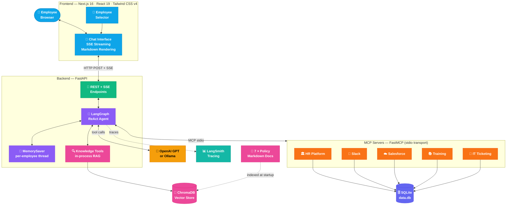
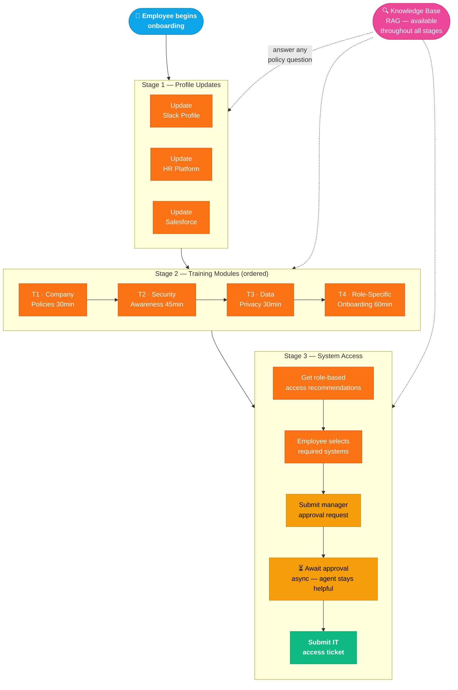
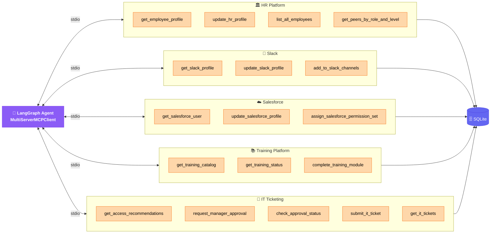
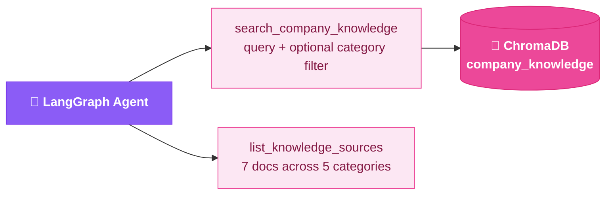
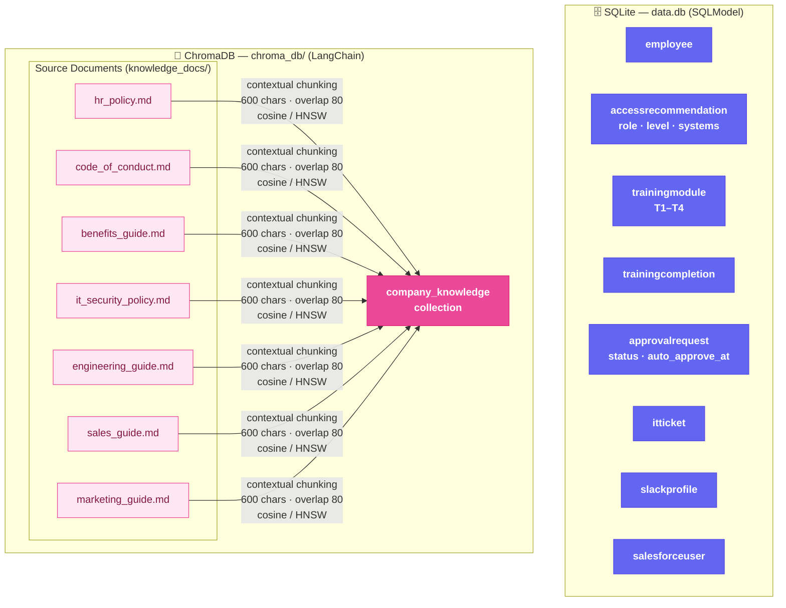

# Acme Corp — Employee Onboarding Agent

> An autonomous AI agent that guides new employees through their entire onboarding journey — updating profiles across SaaS platforms, completing training, requesting system access, and answering role-specific questions from a RAG-powered company knowledge base.


---

## Overview

The **Employee Onboarding Agent** is a full-stack agentic application built as a production-minded prototype. It demonstrates:

- **Native tool calling** via a LangGraph ReAct agent with per-employee memory
- **MCP-style extensibility** — each SaaS integration is a standalone FastMCP server; adding a new one requires zero changes to the orchestration logic
- **Production RAG** over 7 internal policy documents — hybrid BM25 keyword + vector semantic search merged via Reciprocal Rank Fusion, contextual chunking (each chunk prefixed with document title and section header), and cosine similarity (HNSW). Automatic rebuild when documents or the embedding provider changes
- **Persistent state** — all structured data backed by SQLite via SQLModel
- **Real-time streaming** — SSE delivers agent thoughts, tool calls, and responses token-by-token to the frontend
- **Rich markdown rendering** — agent responses rendered with full formatting (headings, lists, code blocks, tables)
- **LangSmith tracing** — full visibility into every agent run, tool call, and token

---

## System Architecture



---

## Agent Loop — ReAct Pattern

```mermaid
flowchart LR
    classDef input fill:#0EA5E9,stroke:#0284C7,color:#fff,font-weight:bold
    classDef think fill:#8B5CF6,stroke:#7C3AED,color:#fff,font-weight:bold
    classDef tool fill:#F97316,stroke:#EA580C,color:#fff,font-weight:bold
    classDef check fill:#F59E0B,stroke:#D97706,color:#000,font-weight:bold
    classDef stream fill:#10B981,stroke:#059669,color:#fff,font-weight:bold

    MSG["📨 User Message\n+ Employee ID"]:::input
    HIST["📜 Conversation\nHistory\nMemorySaver"]:::think
    LLM["🧠 LLM Reasoning\nWhat action next?"]:::think
    TOOL["⚡ Execute Tool\nMCP or in-process"]:::tool
    RES["📋 Tool Result\nback to context"]:::tool
    MORE{"Stop reason\n= tool_use?"}:::check
    STREAM["💬 Stream tokens\nSSE → Frontend"]:::stream
    DONE["✅ done event\nto client"]:::stream

    MSG --> HIST
    HIST --> LLM
    LLM --> TOOL
    TOOL --> RES
    RES --> MORE
    MORE -->|"yes — more tools needed"| LLM
    MORE -->|"no — end_turn"| STREAM
    STREAM --> DONE
```



Each turn the agent autonomously decides which tool to call, executes it, feeds the result back into context, and repeats until it has enough information to respond.

---

## Onboarding Workflow



---

## Tool Architecture

The agent has access to **20 tools** from two sources:

### MCP Servers (5 × FastMCP subprocess, stdio transport)

Each simulates an external SaaS platform. Adding a new server requires **zero changes** to the agent or orchestration logic.



### In-Process Tools (2 × LangChain @tool, ChromaDB RAG)

Knowledge search runs in the main FastAPI process to avoid cross-process ChromaDB file-locking issues on Windows.



---

## Data Architecture



---

## Tech Stack

| Layer | Technology | Purpose |
|---|---|---|
| **Frontend** | Next.js 16, React 19, Tailwind CSS v4, react-markdown | Chat UI, SSE streaming, markdown rendering |
| **Backend** | FastAPI, Python 3.13, Uvicorn | REST API, SSE endpoint, app lifecycle |
| **Agent Orchestration** | LangGraph (`create_react_agent`) | ReAct loop, per-employee conversation state |
| **LLM** | OpenAI GPT-4o-mini / Ollama | Reasoning, tool selection, response generation |
| **MCP Servers** | FastMCP 2.3 | 5 independent mock SaaS integrations (stdio) |
| **MCP Client** | langchain-mcp-adapters | Bridges LangGraph ↔ MCP stdio protocol |
| **Knowledge Tools** | LangChain `@tool` + ChromaDB + rank-bm25 | In-process hybrid RAG: BM25 keyword + vector semantic search via Reciprocal Rank Fusion, contextual chunking, cosine similarity |
| **Structured Data** | SQLModel + SQLite | Employees, training, approvals, tickets |
| **Vector Store** | ChromaDB + langchain-chroma | Semantic search with auto-rebuild on provider change |
| **Embeddings** | OpenAI `text-embedding-3-small` / Ollama `nomic-embed-text` | Document indexing and query embedding |
| **Logging** | structlog | Structured JSON file logs + pretty console |
| **Tracing** | LangSmith | Full agent run visibility |

---

## Project Structure

```
EmployeeOnboardingAgent/
├── frontend/                          # Next.js 16 application
│   └── app/
│       ├── components/
│       │   ├── ChatInterface.tsx      # Main chat UI with SSE streaming
│       │   ├── MessageBubble.tsx      # Markdown rendering + tool activity cards
│       │   └── EmployeeSelector.tsx   # Login / employee picker
│       ├── hooks/
│       │   └── useChat.ts             # SSE streaming state management
│       ├── types/index.ts             # Shared TypeScript types + server colour map
│       ├── page.tsx                   # Root: selector → chat
│       └── layout.tsx
│
└── backend/                           # FastAPI + LangGraph application
    ├── main.py                        # App entry point, startup sequence
    │
    ├── agent/
    │   ├── orchestrator.py            # LangGraph agent + MCP client lifecycle
    │   ├── knowledge_tools.py         # In-process RAG tools (ChromaDB search)
    │   └── prompts.py                 # System prompt
    │
    ├── mcp_servers/                   # One FastMCP server per SaaS
    │   ├── data_store.py              # Seed data (canonical source of truth)
    │   ├── hr_server.py               # HR Platform tools
    │   ├── slack_server.py            # Slack tools
    │   ├── salesforce_server.py       # Salesforce tools
    │   ├── training_server.py         # Training Platform tools
    │   └── it_server.py               # IT Ticketing + manager approval
    │
    ├── database/
    │   ├── engine.py                  # SQLModel engine (shared SQLite file)
    │   ├── models.py                  # All table definitions
    │   └── seed.py                    # One-time data seeding + reset
    │
    ├── knowledge/
    │   └── vector_store.py            # ChromaDB build + provider-aware rebuild
    │
    ├── knowledge_docs/                # Source documents for RAG
    │   ├── hr_policy.md
    │   ├── code_of_conduct.md
    │   ├── benefits_guide.md
    │   ├── it_security_policy.md
    │   ├── engineering_guide.md
    │   ├── sales_guide.md
    │   └── marketing_guide.md
    │
    ├── api/
    │   ├── chat.py                    # POST /api/chat (SSE), GET /api/chat/history
    │   └── admin.py                   # Employees list, MCP servers, DB reset
    │
    ├── utils/
    │   └── logger.py                  # structlog — console + rotating file handler
    │
    ├── logs/                          # Auto-created; app.log rotates at 10 MB
    ├── data.db                        # SQLite database (auto-created)
    ├── chroma_db/                     # ChromaDB persistence (auto-created)
    ├── requirements.txt
    └── .env
```

---

## Getting Started

### Prerequisites

- Python 3.13+ with [uv](https://docs.astral.sh/uv/)
- Node.js 20+
- An OpenAI API key **or** [Ollama](https://ollama.com) running locally

### 1 — Backend

```bash
cd backend

# Copy and configure environment
cp .env.example .env
# Edit .env: add OPENAI_API_KEY or configure Ollama settings

# Initialize Virtual Environment
uv init

# Install dependencies
uv add -r requirements.txt

# If using Ollama — pull required models
ollama pull llama3.1:8b        # chat model
ollama pull nomic-embed-text   # embedding model

# Start the server (DB, seed data, and vector store initialise automatically)
uv run uvicorn main:app --reload
```

The first startup will:
1. Create `data.db` and seed all tables
2. Index the 7 knowledge docs into ChromaDB (subsequent startups skip this if docs and embedding provider are unchanged)
3. Spawn 5 FastMCP subprocesses (HR, Slack, Salesforce, Training, IT)
4. Start the FastAPI server on `http://localhost:8000`

### 2 — Frontend

```bash
cd frontend
cp .env.local.example .env.local
npm install
npm run dev
```

Open [http://localhost:3000](http://localhost:3000), select an employee, and start onboarding.

---

## Environment Variables

### Backend (`.env`)

| Variable | Default | Description |
|---|---|---|
| `OPENAI_API_KEY` | — | OpenAI key. If unset, Ollama is used |
| `MODEL_ID` | `gpt-4o-mini` | OpenAI model ID |
| `OLLAMA_MODEL` | `llama3.1:8b` | Ollama chat model |
| `OLLAMA_BASE_URL` | `http://localhost:11434` | Ollama server URL |
| `OLLAMA_EMBED_MODEL` | `nomic-embed-text` | Ollama embedding model |
| `CORS_ORIGINS` | `http://localhost:3000` | Allowed frontend origins |
| `MAX_TOKENS` | `4096` | Max tokens per LLM response |
| `AUTO_APPROVE_SECONDS` | `30` | Seconds before manager approval auto-approves (demo) |
| `LANGCHAIN_TRACING_V2` | — | Set to `true` to enable LangSmith |
| `LANGCHAIN_API_KEY` | — | LangSmith API key |
| `LANGCHAIN_PROJECT` | `employee-onboarding-agent` | LangSmith project name |

### Frontend (`.env.local`)

| Variable | Default | Description |
|---|---|---|
| `NEXT_PUBLIC_API_URL` | `http://localhost:8000` | Backend API base URL |

---

## API Reference

| Method | Endpoint | Description |
|---|---|---|
| `POST` | `/api/chat` | Send a message; returns SSE stream of agent events |
| `GET` | `/api/chat/history?employee_id=` | Full conversation history for an employee |
| `GET` | `/api/admin/employees` | List employees (used by frontend selector) |
| `GET` | `/api/admin/mcp-servers` | List active MCP servers and their discovered tools |
| `POST` | `/api/admin/reset-db` | Wipe all data and re-seed from mock data |
| `GET` | `/health` | Health check |

### SSE Event Types

```jsonc
{ "type": "text_delta",  "content": "Hi Alice..." }          // streaming token
{ "type": "tool_call",   "tool": "get_employee_profile",
  "server": "hr",        "input": { "employee_id": "emp001" } }
{ "type": "tool_result", "tool": "get_employee_profile",
  "output": "HR Platform — Employee Profile..." }
{ "type": "done" }
{ "type": "error",       "message": "..." }
```

---

## Mock Employees

| ID | Name | Role | Level | Department |
|---|---|---|---|---|
| `emp001` | Alice Johnson | Software Engineer | L3 | Engineering |
| `emp002` | Bob Chen | Account Executive | L2 | Sales |
| `emp003` | Carol Martinez | Marketing Manager | L4 | Marketing |

---

## Adding a New MCP Server

The architecture is designed so new SaaS integrations require **no changes to the agent or orchestration logic**:

1. Create `backend/mcp_servers/your_server.py`:

```python
from fastmcp import FastMCP
mcp = FastMCP("Your Service")

@mcp.tool()
def your_tool(param: str) -> str:
    """Description the LLM uses to decide when to call this tool."""
    return "result"

if __name__ == "__main__":
    mcp.run()
```

2. Register it in `agent/orchestrator.py`:

```python
MCP_SERVERS_CONFIG = {
    ...
    "your_service": {
        "command": "python",
        "args": [str(_SERVERS_DIR / "your_server.py")],
        "transport": "stdio",
    },
}
```

The agent discovers the new tools automatically on next startup — no other changes needed.

---

## Adding Knowledge Documents

Drop any `.md` file into `backend/knowledge_docs/`. The vector store automatically detects the change via content hash on the next startup and re-indexes.

Switching between OpenAI and Ollama embeddings also triggers an automatic rebuild — no manual cleanup required.

---

## Database Reset

To reset all user-entered data (profile updates, training completions, approvals, tickets) back to seed defaults:

```bash
# Via API (while backend is running)
curl -X POST http://localhost:8000/api/admin/reset-db

# Or manually
rm backend/data.db    # re-created on next startup
```

Conversation history (LangGraph MemorySaver) is in-memory only and resets on every backend restart.

---

## Observability

| Tool | What you see |
|---|---|
| **Console logs** | Pretty-printed structured logs per request |
| **`logs/app.log`** | Rotating JSON logs (10 MB × 5 files) |
| **LangSmith** | Full agent traces — every LLM call, tool call, token count, latency, and conversation thread |

Enable LangSmith by adding to `.env`:
```env
LANGCHAIN_TRACING_V2=true
LANGCHAIN_API_KEY=ls__your-key
LANGCHAIN_PROJECT=employee-onboarding-agent
```
